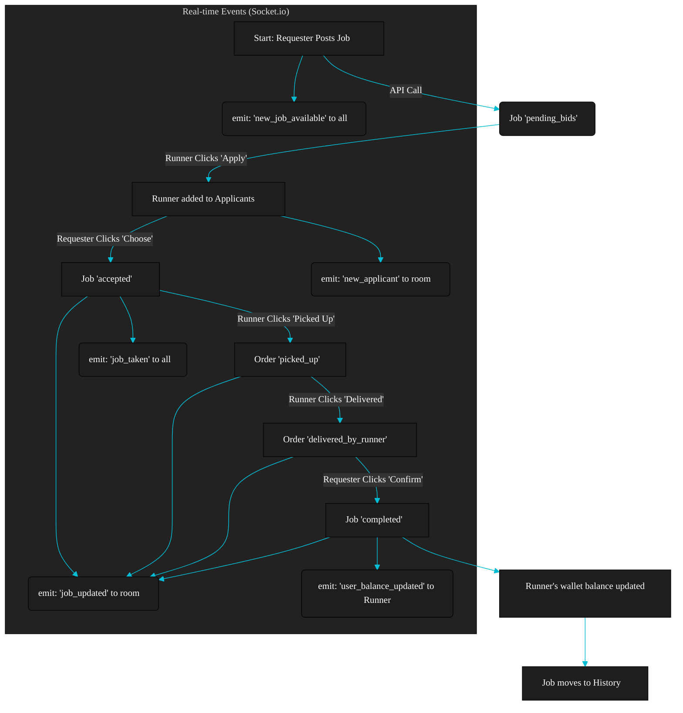

<p align="center">  </p>

<h1 align="center"> Gatedrop: P2P Campus Delivery</h1>

<p align="center"> <strong>Gatedrop is a hyper-local, real-time, peer-to-peer delivery platform built for your college campus.</strong> <br /> It connects students who need items ("Requesters") with students who can deliver them ("Runners"). </p>

<p align="center">          </p>
---
## DEMO 
<p align="center"> 

  <a href="https://gatedrop.vercel.app" target="_blank"></a>
  <a href="https://drive.google.com/drive/folders/1OZWvhk9z0_tRpqdNZtztnWJWmbQLDBcW?usp=sharing" target="_blank"></a>
</p>
---
##  Core Features

  * **Real-time Job Marketplace:** The "Available Jobs" feed is powered by WebSockets. When a Requester posts a job, it instantly appears on every Runner's screen without a refresh.
  * **Live Runner Tracking:** Our hackathon-winning feature\! Requesters can track their Runner's location in real-time on a custom, pixel-art map of the campus.
  * **In-App Wallet & Cashout:** Runners receive their payment instantly to their Gatedrop wallet upon confirmed delivery. They can request a cashout from their profile.
  * **Secure College-Only Verification:** Signup is restricted to a specific college email domain (`@mail.jiit.ac.in`). The system verifies each user by sending a 6-digit OTP via a professionally branded HTML email.
  * **Mobile-First UI:** A responsive design featuring a fixed bottom navigation bar for a native app feel.
  * **Progressive Web App (PWA):** Gatedrop is fully installable on mobile devices and supports offline access.
  * **Accountability System:** A "Report & Ban" feature ensures safety. If a Runner is reported 3 times, their account is automatically restricted from accepting new jobs.

-----

##  Job Lifecycle Flowchart 

This diagram shows the complete flow of a job from posting to completion, including the real-time events.



-----

##  Tech Stack

### Frontend (Client)

  * **Framework:** React (via Vite)
  * **Language:** TypeScript
  * **Styling:** TailwindCSS
  * **Components:** shadcn/ui
  * **Routing:** React Router v6
  * **State Management:** React Context (for Auth & Socket)
  * **Real-time:** Socket.io-Client
  * **PWA:** `vite-plugin-pwa`

### Backend (Server)

  * **Framework:** Node.js, Express.js
  * **Language:** TypeScript
  * **Real-time:** Socket.io
  * **Authentication:** JSON Web Tokens (JWT)
  * **Password Hashing:** `bcrypt.js`

### Database

  * **Database:** MongoDB
  * **ODM:** Mongoose (for schemas, transactions, and models)

### External Services & Deployment

  * **Email (OTP):** Mailjet API
  * **Frontend Deployment:** Vercel
  * **Backend Deployment:** Render.com (Chosen for WebSocket support)

-----

##  How Our Unique Features Work

### 1\. Live Location Tracking (The "WOW" Feature)

We built a custom, real-time tracking system without relying on expensive, paid map APIs.

1.  **Map Asset:** We use a custom-made pixel-art image of the college (`public/college-map.png`) as a static background.
2.  **Calibration:** We created a mapping (`src/lib/map-calibration.ts`) that defines the **GPS coordinates (Lat, Lon)** for the top-left and bottom-right corners of our map image.
3.  **Runner (Sender):** When a Runner's job status is `picked_up`, their app activates `navigator.geolocation.watchPosition()`. Every 10 seconds, it `socket.emit('runner_location_update', ...)` with their live Lat/Lon.
4.  **Backend (Relay):** The backend receives this event and *only* relays it to the specific job's private room: `io.to(jobId).emit('job_location_updated', location);`
5.  **Requester (Receiver):** The Requester's app listens for `job_location_updated`. A function (`convertGpsToPercent`) then uses the calibration data to convert the Runner's live Lat/Lon into `(x, y)` percentage values.
6.  **Result:** A blue dot representing the Runner moves smoothly across the static map image using CSS `transform`.

### 2\. Email OTP Verification (Mailjet)

This is a 2-phase system to ensure only legitimate students can sign up.

  * **Phase 1: Request (`POST /api/auth/request-otp`)**

    1.  Frontend sends an email (e.g., `test@mail.jiit.ac.in`).
    2.  Backend checks if the domain is valid and if the user already exists.
    3.  A 6-digit OTP is generated and saved to a temporary `OtpVerification` collection in MongoDB (which has a 10-minute auto-expiry).
    4.  The backend calls the `sendOtpEmail` service, which uses the Mailjet API to send a branded HTML email (with logo) to the user.

  * **Phase 2: Verify (`POST /api/auth/signup`)**

    1.  Frontend sends all user data *plus* the 6-digit OTP.
    2.  Backend finds the OTP in the database, checks if it matches and hasn't expired.
    3.  If valid, the OTP record is deleted, the new `User` is created (with a hashed password), and a JWT token is returned.

### 3\. Instant Wallet Update (Socket.io)

We wanted the Runner's wallet balance in the header to update *instantly* upon job completion, no matter what page they are on.

1.  **Backend (`POST /api/jobs/:id/confirm`):**

      * After the Requester confirms, the backend updates the Runner's `walletBalance` in the database.
      * It then emits **two** events:
        1.  `io.to(jobId).emit('job_updated', job);` (To update the order page)
        2.  `io.emit('user_balance_updated', { userId: runner._id, newBalance: ... });` (A global event)

2.  **Frontend (`DashboardLayout.tsx`):**

      * The main layout component (which contains the header) is *always* listening for the `user_balance_updated` event.
      * When it hears the event, it checks if the `userId` matches the logged-in user.
      * If it matches, it calls the `refreshUser()` function from `AuthContext`, which re-fetches the user data and instantly updates the wallet balance in the header.

-----

## 🏁 Getting Started (Local Development)

### Prerequisites

  * Node.js (v18+)
  * Bun (v1.x)
  * MongoDB Atlas Account (for `MONGODB_URI`)
  * Mailjet Account (for API keys and a validated sender email)

### 1\. Backend Setup

```bash
# 1. Go into the backend folder
cd gatedrop-backend

# 2. Install dependencies
npm install

# 3. Create your environment file
touch .env

# 4. Add your secrets to the .env file
# (See .env.example or the list below)

# 5. Run the backend server
npm run dev
```

**`gatedrop-backend/.env` keys:**

```ini
MONGODB_URI="your_mongodb_atlas_connection_string"
JWT_SECRET="your_super_strong_jwt_secret"
MJ_APIKEY_PUBLIC="your_mailjet_public_key"
MJ_APIKEY_PRIVATE="your_mailjet_private_key"
MJ_SENDER_EMAIL="your_validated_sender_email@domain.com"
MJ_SENDER_NAME="Gatedrop Team"
ADMIN_SECRET_KEY="your_admin_secret"
FRONTEND_URL="http://localhost:5173" # Your frontend URL
```

### 2\. Frontend Setup

```bash
# 1. Go to the root folder (if you were in the backend)
cd ..

# 2. Install dependencies
npm install

# 3. Create your environment file
touch .env

# 4. Add your local backend URL to the .env file
echo "VITE_API_URL=http://localhost:5000" > .env

# 5. Run the frontend server
npm run dev
```

**Your app should now be running\!**

  * Frontend: `http://localhost:5173`
  * Backend: `http://localhost:5000`
